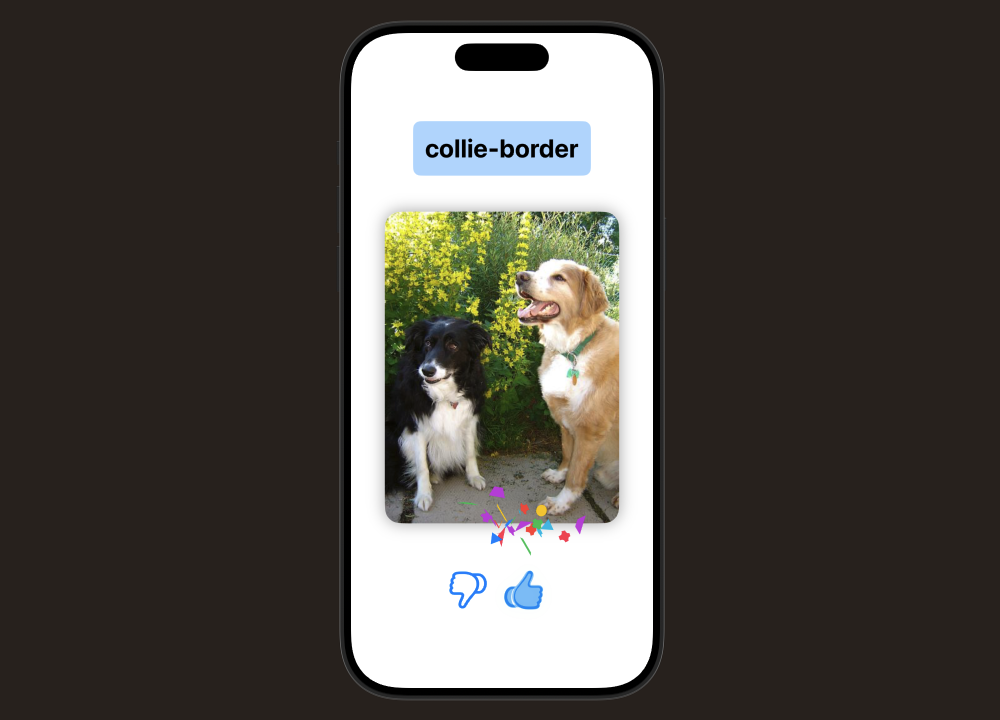

# DogLike  

  

This SwiftUI app lets users **swipe through dogs and rate them with a like or dislike**, similar to dating apps. 🐶💚  
Each dog is displayed with its **picture and breed**, and after every decision, a new dog appears.  

This project was developed as part of my training.  

## Features  

- ✅ Like & dislike dogs with a single tap  
- ✅ Display of dogs with picture and breed  
- ✅ Automatic presentation of a new dog after each rating  
- ✅ Local notifications (with permission request)  
- ✅ Micro interactions with **animated SF Symbols & custom animations**  
- ✅ Swift Testing for code quality assurance  
- ✅ Support for taps & gestures in the UI  

## Technologies  

- SwiftUI  
- Swift Testing  
- Local Notifications  
- SF Symbols animations & custom animations  
- MVVM architecture  
- @State, @Binding for state management  
- Gestures and interactions with SwiftUI  

## How to Run  

1. Click the green **"Code"** button on this repository and select **"Open with Xcode"** (if available), or download the ZIP and open the project manually.  
2. Alternatively, open the `.xcodeproj` or `.xcworkspace` file directly in **Xcode**.  
3. Click the **Run** ▶️ button in the top toolbar to build and launch the app in the iOS Simulator or on a physical device.  
4. Use the app to swipe through dogs, rate them with like/dislike, and experience the animations and notifications.  

---

📝 Disclaimer  

This project was developed as part of my training. The source code, structure, and documentation are my own work.  

© 2025 Jeff Braun. All rights reserved. Licensed under the [MIT License](./LICENSE).  
